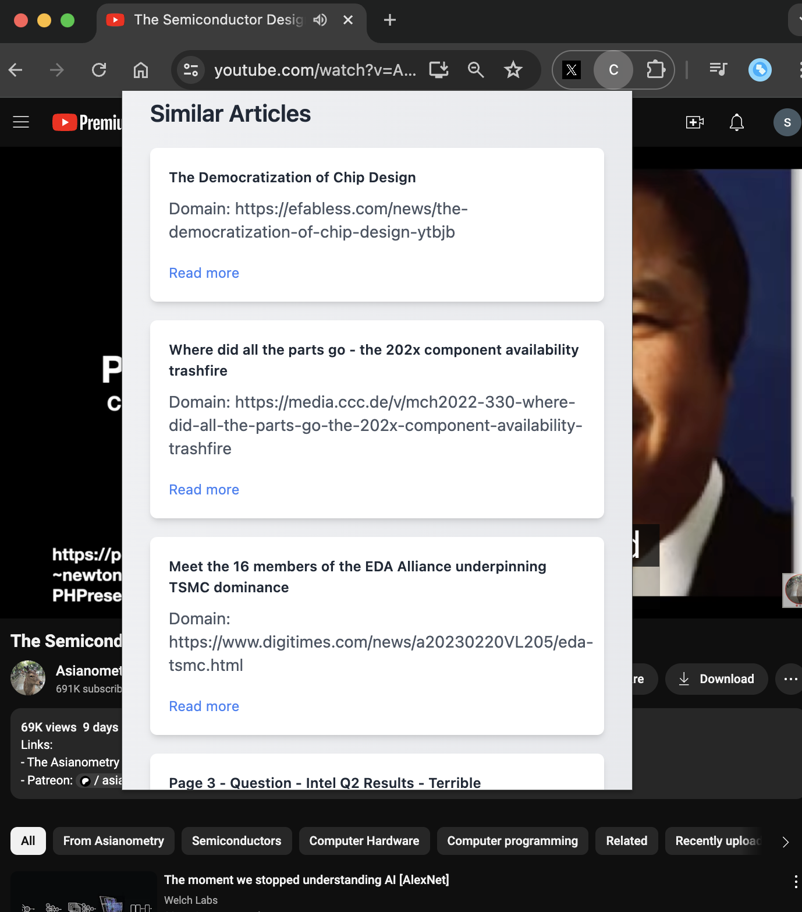

# Content Summarizer

This is a Chrome extension that summarizes the content of a webpage in a single sentence. It uses the OpenAI API to generate the summary.

## Features

- Summarizes the content of a webpage.
- Supports YouTube videos.
- Gets similar articles from Exa.ai.
- Caches the summary and similar articles locally.

## Installation

1. Clone the repository.
2. Load environment variables from `.env.example` to `.env`.
3. Build the project using `pnpm run build`.
4. Open Chrome and go to `chrome://extensions`.
3. Enable Developer Mode.
4. Click on "Load Unpacked" and select the `dist` folder.
5. You are all set!

